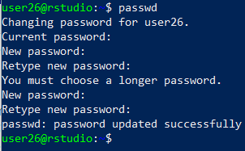
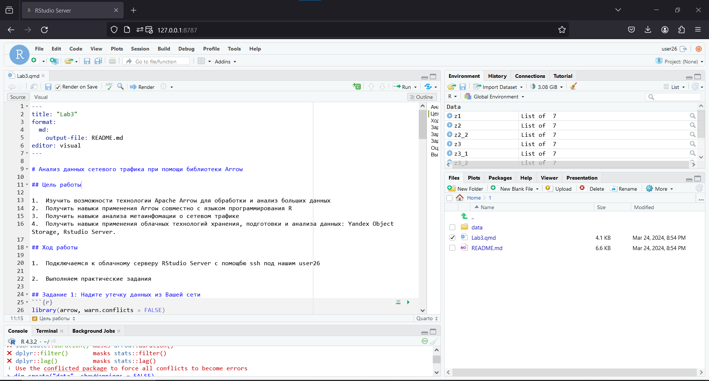

# lab3

# Анализ данных сетевого трафика при помощи библиотеки Arrow

## Цель работы

1.  Изучить возможности технологии Apache Arrow для обработки и анализ
    больших данных
2.  Получить навыки применения Arrow совместно с языком программирования
    R
3.  Получить навыки анализа метаинфомации о сетевом трафике
4.  Получить навыки применения облачных технологий хранения, подготовки
    и анализа данных: Yandex Object Storage, Rstudio Server.

## Ход работы

1.  Подключаемся к облачному серверу RStudio Server с помощбю ssh под
    нашим user26

    

    

    

2.  Выполняем практические задания

## Задание 1: Надите утечку данных из Вашей сети

``` r
library(arrow, warn.conflicts = FALSE)
```

You can add options to executable code like this

``` r
library(tidyverse, warn.conflicts = FALSE)
```

    ── Attaching core tidyverse packages ──────────────────────── tidyverse 2.0.0 ──
    ✔ dplyr     1.1.4     ✔ readr     2.1.5
    ✔ forcats   1.0.0     ✔ stringr   1.5.1
    ✔ ggplot2   3.5.0     ✔ tibble    3.2.1
    ✔ lubridate 1.9.3     ✔ tidyr     1.3.1
    ✔ purrr     1.0.2     
    ── Conflicts ────────────────────────────────────────── tidyverse_conflicts() ──
    ✖ lubridate::duration() masks arrow::duration()
    ✖ dplyr::filter()       masks stats::filter()
    ✖ dplyr::lag()          masks stats::lag()
    ℹ Use the conflicted package (<http://conflicted.r-lib.org/>) to force all conflicts to become errors

``` r
dir.create("data", showWarnings = FALSE)

curl::multi_download(
  "https://storage.yandexcloud.net/arrow-datasets/tm_data.pqt",
  "data/testdata",
  resume = TRUE
)
```

    # A tibble: 1 × 10
      success status_code resumefrom url    destfile error type  modified           
      <lgl>         <int>      <dbl> <chr>  <chr>    <chr> <chr> <dttm>             
    1 TRUE            206          0 https… "C:\\Us… <NA>  appl… 2024-02-19 15:25:05
    # ℹ 2 more variables: time <dbl>, headers <list>

``` r
dt <- open_dataset(
  sources = "data/testdata",
  schema = schema(timestamp=int64(),src=utf8(),dst=utf8(),port=uint32(),bytes=uint32())
)
glimpse(dt)
```

    FileSystemDataset with 1 Parquet file
    105,747,730 rows x 5 columns
    $ timestamp <int64> 1578326400001, 1578326400005, 1578326400007, 1578326400011, …
    $ src      <string> "13.43.52.51", "16.79.101.100", "18.43.118.103", "15.71.108.…
    $ dst      <string> "18.70.112.62", "12.48.65.39", "14.51.30.86", "14.50.119.33"…
    $ port     <uint32> 40, 92, 27, 57, 115, 92, 65, 123, 79, 72, 123, 123, 22, 118,…
    $ bytes    <uint32> 57354, 11895, 898, 7496, 20979, 8620, 46033, 1500, 979, 1036…

``` r
z1 <- dt %>%
  filter(str_detect(src, "^12.") | str_detect(src, "^13.") | str_detect(src, "^14."))  %>%
  filter(!str_detect(dst, "^12.") | !str_detect(dst, "^13.") | !str_detect(dst, "^14."))  %>%
  group_by(src) %>% summarise("sum" = sum(bytes)) %>%  
  filter(sum>6000000000) %>% select(src,sum) 
z1 |> collect()
```

    # A tibble: 1 × 2
      src                  sum
      <chr>              <dbl>
    1 13.37.84.125 11152202376

## Задание 2: Надите утечку данных 2

``` r
z2 <- dt %>%
      select(timestamp, src, dst, bytes) %>%
      mutate(trafic = (str_detect(src, "^((12|13|14)\\.)") & !str_detect(dst, "^((12|13|14)\\.)")),time = hour(as_datetime(timestamp/1000))) %>%
      filter(trafic == TRUE, time >= 0 & time <= 24) %>% group_by(time) %>%
      summarise(trafictime = n()) %>% arrange(desc(trafictime))
z2 |> collect()
```

    # A tibble: 24 × 2
        time trafictime
       <int>      <int>
     1    16    4490576
     2    22    4489703
     3    18    4489386
     4    23    4488093
     5    19    4487345
     6    21    4487109
     7    17    4483578
     8    20    4482712
     9    13     169617
    10     7     169241
    # ℹ 14 more rows

``` r
z2_2 <- dt %>% mutate(time = hour(as_datetime(timestamp/1000))) %>% 
  filter(!str_detect(src, "^13.37.84.125")) %>% 
  filter(str_detect(src, "^12.") | str_detect(src, "^13.") | str_detect(src, "^14."))  %>%
  filter(!str_detect(dst, "^12.") | !str_detect(dst, "^13.") | !str_detect(dst, "^14."))  %>%
  filter(time >= 1 & time <= 15) %>% 
  group_by(src) %>% summarise("sum" = sum(bytes)) %>%
  filter(sum>290000000) %>% select(src,sum) 
z2_2 |> collect()
```

    # A tibble: 1 × 2
      src               sum
      <chr>           <int>
    1 12.55.77.96 298669501

## Задание 3: Надите утечку данных 3

``` r
z3 <- dt %>% filter(!str_detect(src, "^13.37.84.125")) %>% 
  filter(!str_detect(src, "^12.55.77.96")) %>% 
  filter(str_detect(src, "^12.") | str_detect(src, "^13.") | str_detect(src, "^14."))  %>%
  filter(!str_detect(dst, "^12.") | !str_detect(dst, "^13.") | !str_detect(dst, "^14."))  %>% select(src, bytes, port) 


z3_1 <-z3 %>%  group_by(port) %>% summarise("mean"=mean(bytes), "max"=max(bytes), "sum" = sum(bytes)) %>% 
  mutate("Raz"= max-mean)  %>% filter(Raz!=0, Raz>170000)

z3_1 |> collect()
```

    # A tibble: 1 × 5
       port   mean    max         sum     Raz
      <int>  <dbl>  <int>       <dbl>   <dbl>
    1    37 33348. 209402 48192673159 176054.

``` r
z3_2 <- z3  %>% filter(port==37) %>% group_by(src) %>% 
  summarise("mean"=mean(bytes)) %>% filter(mean>37543) %>% select(src)
z3_2 |> collect()
```

    # A tibble: 1 × 1
      src        
      <chr>      
    1 13.46.35.35

## Оценка результатов

Задача выполнена при помощи облачных технологий, приложения RStudio и
Apache Arrow, удалось познакомится с функционалом Arrow и при его помощи
удалось выполнить задание.

## Вывод

В данной работе я смог познакомиться с применением облачных технологий
хранения, подготовки и анализа данных. Удалось проанализировать
метаинформацию о сетевом трафике.
